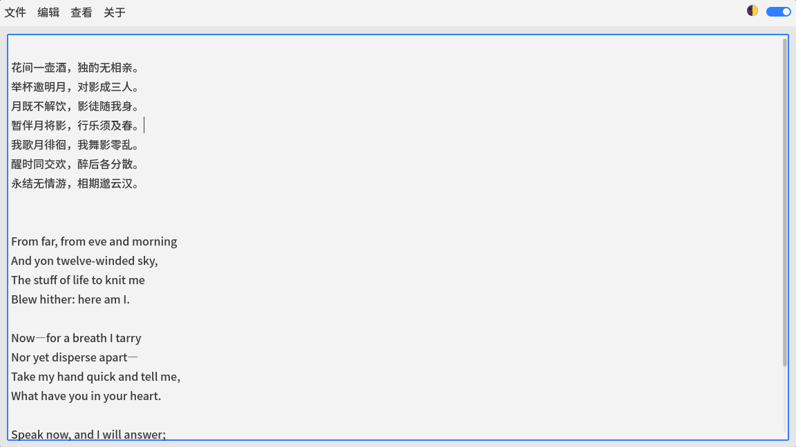
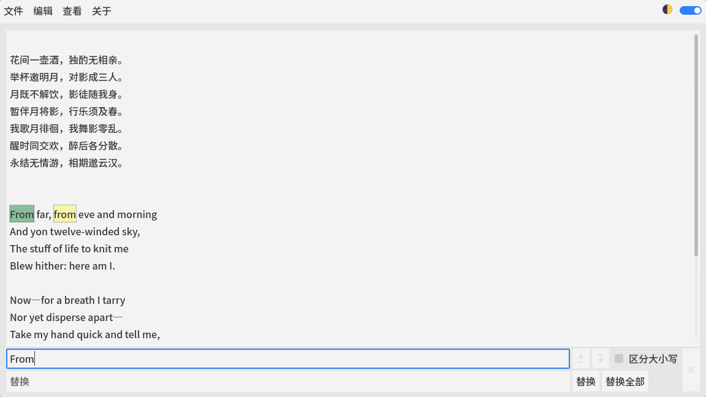

# GoteEdit

一个带查找替换栏的 Godot 文本编辑控件。

A Godot text editing control with a built-in Find & Replace bar.

## 简介 Overview

GoteEdit 是一个可复用场景、一个功能强大的文本编辑控件。在 TextEdit 的基础上开发而成。

GoteEdit is a reusable scene and a powerful text editing control, based on TextEdit.

## 特色功能 Features

- 查找替换栏 Find & Replace bar

- 封装好的新建、打开、保存文件函数 Built-in functions for **New**, **Open**, and **Save** file operations

## 截图 Screenshots

截图来自范例项目 GotePad。

Screenshots are from the example project GotePad.

## 使用方式 Usage

1. 将 gote_edit 文件夹添加到您的Godot项目中。Add the **gote_edit** folder to your Godot project.
2. 将 GoteEdit.tscn 添加到场景树中。Add **GoteEdit.tscn** to the scene tree.

## 项目链接 Links

[GoteEdit - Godot Asset Store](https://store.godotengine.org/asset/brothershort-shesi-studio/goteedit/)

[GoteEdit - GitHub](https://github.com/BrotherShort/GoteEdit)

[GotePad - GitHub](https://github.com/BrotherShort/GotePad) （范例项目）(Example project)

## 授权协议 License

本项目以 MIT 协议发布。

第三方资源：

部分图标来自 Godot 引擎，GoteEdit logo  使用了 Godot 引擎 logo 元素。

> Godot Engine
>  from https://godotengine.org/
>  under the MIT license

This project is licensed under the MIT license.

Third-party resources:

Some icons are from the Godot Engine. The GoteEdit logo  incorporates elements of the Godot engine logo.

> Godot Engine
>  from https://godotengine.org/
>  under the MIT license
